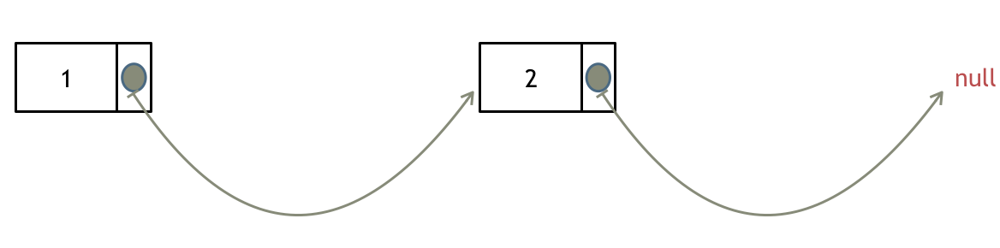

# 203

# Problem

Given the `head` of a linked list and an integer `val`, remove all the nodes of the linked list that has `Node.val == val`, and return *the new head*.

 

**Example 1:**


```
Input: head = [1,2,6,3,4,5,6], val = 6
Output: [1,2,3,4,5]
```

**Example 2:**

```
Input: head = [], val = 1
Output: []
```

**Example 3:**

```
Input: head = [7,7,7,7], val = 7
Output: []
```

 

**Constraints:**

- The number of nodes in the list is in the range `[0, 104]`.
- `1 <= Node.val <= 50`
- `0 <= val <= 50`


## Classification & Discussion


****

# Solution

https://programmercarl.com/0203.%E7%A7%BB%E9%99%A4%E9%93%BE%E8%A1%A8%E5%85%83%E7%B4%A0.html#%E6%80%9D%E8%B7%AF


如果使用C，C++编程语言的话，不要忘了还要从内存中删除这两个移除的节点， 清理节点内存之后如图：



**当然如果使用java ，python的话就不用手动管理内存了。**

其实**可以设置一个虚拟头结点**，这样原链表的所有节点就都可以按照统一的方式进行移除了。

来看看如何设置一个虚拟头。依然还是在这个链表中，移除元素1。


### ==Step==

1. 当遇到链表可能删除头节点的时候，使用dummyhead, 可以简化操作


## Important details

- 还是有很多细节需要注意
  - 比如注意现在指针指向的节点和需要删除的节点的关系
  - 注意，当删除节点的时候，删除完成之后指针不需要向后推进，因为现在p.next指向了新的节点

```python
            if p.next.val == val:
                p.next = p.next.next
            else:
                p = p.next
```


## Code

```python
# Definition for singly-linked list.
# class ListNode:
#     def __init__(self, val=0, next=None):
#         self.val = val
#         self.next = next
class Solution:
    def removeElements(self, head: Optional[ListNode], val: int) -> Optional[ListNode]:
        dummy_head = ListNode()
        dummy_head.next = head
        p = dummy_head
        while p.next:
            # del val node
            if p.next.val == val:
                p.next = p.next.next
            else:
                p = p.next
        return dummy_head.next
# time: O(n)
# space: O(1)

```


## Complexity

Time Complexity: O(n)

Space Complexity: O(1)

# 707

# Problem

Design your implementation of the linked list. You can choose to use a singly or doubly linked list.
A node in a singly linked list should have two attributes: `val` and `next`. `val` is the value of the current node, and `next` is a pointer/reference to the next node.
If you want to use the doubly linked list, you will need one more attribute `prev` to indicate the previous node in the linked list. Assume all nodes in the linked list are **0-indexed**.

Implement the `MyLinkedList` class:

- `MyLinkedList()` Initializes the `MyLinkedList` object.
- `int get(int index)` Get the value of the `indexth` node in the linked list. If the index is invalid, return `-1`.
- `void addAtHead(int val)` Add a node of value `val` before the first element of the linked list. After the insertion, the new node will be the first node of the linked list.
- `void addAtTail(int val)` Append a node of value `val` as the last element of the linked list.
- `void addAtIndex(int index, int val)` Add a node of value `val` before the `indexth` node in the linked list. If `index` equals the length of the linked list, the node will be appended to the end of the linked list. If `index` is greater than the length, the node **will not be inserted**.
- `void deleteAtIndex(int index)` Delete the `indexth` node in the linked list, if the index is valid.

 

**Example 1:**

```
Input
["MyLinkedList", "addAtHead", "addAtTail", "addAtIndex", "get", "deleteAtIndex", "get"]
[[], [1], [3], [1, 2], [1], [1], [1]]
Output
[null, null, null, null, 2, null, 3]

Explanation
MyLinkedList myLinkedList = new MyLinkedList();
myLinkedList.addAtHead(1);
myLinkedList.addAtTail(3);
myLinkedList.addAtIndex(1, 2);    // linked list becomes 1->2->3
myLinkedList.get(1);              // return 2
myLinkedList.deleteAtIndex(1);    // now the linked list is 1->3
myLinkedList.get(1);              // return 3
```

 

**Constraints:**

- `0 <= index, val <= 1000`
- Please do not use the built-in LinkedList library.
- At most `2000` calls will be made to `get`, `addAtHead`, `addAtTail`, `addAtIndex` and `deleteAtIndex`.


## Classification & Discussion

需要第二遍完成双向链表的design，现在只完成单向链表的design


****

# Solution

- 构造 List Node

  ```python
  class ListNode:
      def __init__(self, val=0, next=None):
          self.val = val
          self.next = next
  ```

### ==Step==

- 使用头节点可以简化很多


## Important details

- 边界条件，index 也有可能小于0
- 边插入node/删除node时记录size变化即可，不需要另外算，更简洁
- 注意查找index的 range(index) 或者 range(Index + 1) 细节


## Code

- singly linked list

```python
class ListNode:
    def __init__(self, val=0, next=None):
        self.val = val
        self.next = next

class MyLinkedList:

    def __init__(self):
        # O(1)
        # set dummy head
        self.dummy_head = ListNode()
        self.length = 0

    def get(self, index: int) -> int:
        # O(n)
        # use for loop to get node at index
        if index < 0 or index >= self.length:
            return -1
        # 
        p = self.dummy_head
        for i in range(index + 1):
            p = p.next
        return p.val

    def addAtHead(self, val: int) -> None:
        # O(1)
        p = self.dummy_head
        new_node = ListNode(val)
        new_node.next = p.next
        p.next = new_node
        self.length += 1


    def addAtTail(self, val: int) -> None:
        # O(n)
        p = self.dummy_head
        while p.next:
            p = p.next
        new_node = ListNode(val)
        p.next = new_node
        self.length += 1


    def addAtIndex(self, index: int, val: int) -> None:
        if index < 0 or index > self.length:
            return

        p = self.dummy_head
        # range(index) not range(index + 1)
        for i in range(index):
            p = p.next
        # p stops at the node before the node at the index
        new_node = ListNode(val)
        # if p.next:
        #     new_node.next = p.next
        #     p.next = new_node
        # else:
        #     p.next = new_node
        new_node.next = p.next
        p.next = new_node
        self.length += 1
        

    def deleteAtIndex(self, index: int) -> None:
        if index < 0 or index >= self.length:
            return

        p = self.dummy_head
        for i in range(index):
            p = p.next
        p.next = p.next.next
        self.length -= 1
        


# Your MyLinkedList object will be instantiated and called as such:
# obj = MyLinkedList()
# param_1 = obj.get(index)
# obj.addAtHead(val)
# obj.addAtTail(val)
# obj.addAtIndex(index,val)
# obj.deleteAtIndex(index)
```

- doubly linked list

```python
class ListNode:
    def __init__(self, val=0, pre=None, next=None):
        self.val = val
        self.pre = pre
        self.next = next

class MyLinkedList:

    def __init__(self):
        # O(1)
        # set dummy head
        self.dummy_head = ListNode()
        self.length = 0

    def get(self, index: int) -> int:
        # O(n)
        # use for loop to get node at index
        if index < 0 or index >= self.length:
            return -1
        # 
        p = self.dummy_head
        for i in range(index + 1):
            p = p.next
        return p.val

    def addAtHead(self, val: int) -> None:
        # O(1)
        p = self.dummy_head
        new_node = ListNode(val)
        new_node.next = p.next
        if new_node.next:
            new_node.next.pre = new_node
        p.next = new_node
        self.length += 1


    def addAtTail(self, val: int) -> None:
        # O(n)
        p = self.dummy_head
        while p.next:
            p = p.next
        new_node = ListNode(val)
        p.next = new_node
        new_node.pre = p
        self.length += 1


    def addAtIndex(self, index: int, val: int) -> None:
        if index < 0 or index > self.length:
            return

        p = self.dummy_head
        # range(index) not range(index + 1)
        for i in range(index):
            p = p.next
        # p stops at the node before the node at the index
        new_node = ListNode(val)
        new_node.next = p.next
        if new_node.next:
            new_node.next.pre = new_node
        new_node.pre = p
        p.next = new_node
        self.length += 1
        

    def deleteAtIndex(self, index: int) -> None:
        if index < 0 or index >= self.length:
            return

        p = self.dummy_head
        for i in range(index):
            p = p.next
        p.next = p.next.next
        if p.next:
            p.next.pre = p
        self.length -= 1
        


# Your MyLinkedList object will be instantiated and called as such:
# obj = MyLinkedList()
# param_1 = obj.get(index)
# obj.addAtHead(val)
# obj.addAtTail(val)
# obj.addAtIndex(index,val)
# obj.deleteAtIndex(index)
```


## Complexity

Time Complexity: 有index为 O(n), 其余为O(1)

Space Complexity: O(n)

# 206

# Problem

Given the `head` of a singly linked list, reverse the list, and return *the reversed list*.

 

**Example 1:**


```
Input: head = [1,2,3,4,5]
Output: [5,4,3,2,1]
```

**Example 2:**


```
Input: head = [1,2]
Output: [2,1]
```

**Example 3:**

```
Input: head = []
Output: []
```

 

**Constraints:**

- The number of nodes in the list is the range `[0, 5000]`.
- `-5000 <= Node.val <= 5000`

 

**Follow up:** A linked list can be reversed either iteratively or recursively. Could you implement both?


## Classification & Discussion


****

# Solution


## Important details


## Code  iteratively

- 代码随想录
  - 主要用两个指针就可以实现
  - 先定义cur, 后定义temp, 可以防止cur指向None的时候 temp = cur.next报错

```python
# Definition for singly-linked list.
# class ListNode:
#     def __init__(self, val=0, next=None):
#         self.val = val
#         self.next = next
class Solution:
    def reverseList(self, head: Optional[ListNode]) -> Optional[ListNode]:
        cur = head
        pre = None
        while cur:
            temp = cur.next
            cur.next = pre
            pre = cur
            cur = temp
        return pre
      
# time: O(n)
# space: O(1)
```


- lyy

```python
# Definition for singly-linked list.
# class ListNode:
#     def __init__(self, val=0, next=None):
#         self.val = val
#         self.next = next
class Solution:
    def reverseList(self, head: Optional[ListNode]) -> Optional[ListNode]:
        if head == None or head.next == None:
            return head
        pre_node, cur_node, next_node = head, head.next, head.next.next
        head.next = None
        while next_node:
            cur_node.next = pre_node
            pre_node = cur_node
            cur_node = next_node
            next_node = next_node.next
        cur_node.next = pre_node
        return cur_node

# time: O(n)
# space: O(1)
```


### Code recursively

[recursion](../00_solve_algo_steps/recursion.md)

- 代码随想录

```python
# Definition for singly-linked list.
# class ListNode:
#     def __init__(self, val=0, next=None):
#         self.val = val
#         self.next = next
class Solution:
    def reverseList(self, head: Optional[ListNode]) -> Optional[ListNode]:
        # 只有当 nodes == 0 的时候走这个判断
        if head is None:
            return None
        # nodes == 1 or nodes >= 2 时走这个判断
        if head.next is None:
            return head

        # nodes >= 2 才会走到这步
        # 最后一个节点返回的时候，因为head.next是最后一个节点
        # 所以本层的head是倒数第二个节点
        last = self.reverseList(head.next)
        # 
        head.next.next = head
        # 1. 因为head.next此时已经没有用了，所以可以把head.next设置为None
        # 2. 同时因为在递归回来原来的第一个节点时，必须要把第一个节点的next设置为None
        # 同时兼顾了以上两种情况
        head.next = None
        return last
```


- lyy

```python
# Definition for singly-linked list.
# class ListNode:
#     def __init__(self, val=0, next=None):
#         self.val = val
#         self.next = next
class Solution:
    def recReverse(self, head):
        if head.next is None:
            return head
        res = self.recReverse(head.next)
        head.next.next = head
        return res
    # 
    def reverseList(self, head: Optional[ListNode]) -> Optional[ListNode]:
        if head is None:
            return None
        newHead = self.recReverse(head)
        head.next = None
        return newHead
        

```

- 时间复杂度: O(n), 要递归处理链表的每个节点
- 空间复杂度: O(n), 递归调用了 n 层栈空间


## Best Complexity

Time Complexity: O(n) 

Space Complexity: O(1)