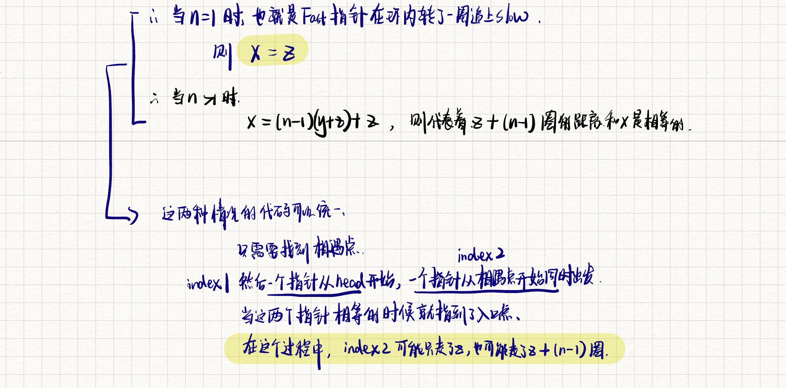

# Problem

Given the `head` of a linked list, return *the node where the cycle begins. If there is no cycle, return* `null`.

There is a cycle in a linked list if there is some node in the list that can be reached again by continuously following the `next` pointer. Internally, `pos` is used to denote the index of the node that tail's `next` pointer is connected to (**0-indexed**). It is `-1` if there is no cycle. **Note that** `pos` **is not passed as a parameter**.

**Do not modify** the linked list.

 

**Example 1:**


```
Input: head = [3,2,0,-4], pos = 1
Output: tail connects to node index 1
Explanation: There is a cycle in the linked list, where tail connects to the second node.
```

**Example 2:**


```
Input: head = [1,2], pos = 0
Output: tail connects to node index 0
Explanation: There is a cycle in the linked list, where tail connects to the first node.
```

**Example 3:**


```
Input: head = [1], pos = -1
Output: no cycle
Explanation: There is no cycle in the linked list.
```

 

**Constraints:**

- The number of the nodes in the list is in the range `[0, 104]`.
- `-105 <= Node.val <= 105`
- `pos` is `-1` or a **valid index** in the linked-list.

 

**Follow up:** Can you solve it using `O(1)` (i.e. constant) memory?


## Classification & Discussion

代码简单但是思路难


****

# Solution





### ==Step==


## Important details


## Code

```python
# Definition for singly-linked list.
# class ListNode:
#     def __init__(self, x):
#         self.val = x
#         self.next = None

class Solution:
    def detectCycle(self, head: Optional[ListNode]) -> Optional[ListNode]:
        fast, slow = head, head
        while fast is not None and fast.next is not None:
            fast = fast.next.next
            slow = slow.next
            if fast == slow:
                # index1 records the node that fast and slow encounters
                index1 = fast
                index2 = head
                while index1 != index2:
                    index1 = index1.next
                    index2 = index2.next
                return index1
        return None

# time: O(n)
# space: O(1)
```


# Solution

- 直接使用集合保存走过的节点即可

### ==Step==


## Important details


## Code

```python
# Definition for singly-linked list.
# class ListNode:
#     def __init__(self, x):
#         self.val = x
#         self.next = None

class Solution:
    def detectCycle(self, head: Optional[ListNode]) -> Optional[ListNode]:
        visted = set()
        while head:
            if head in visted:
                return head
            visted.add(head)
            head = head.next
        return None

# time: O(n)
# space: O(n)
```


## Best Complexity

Time Complexity: O(n)

Space Complexity: O(1)