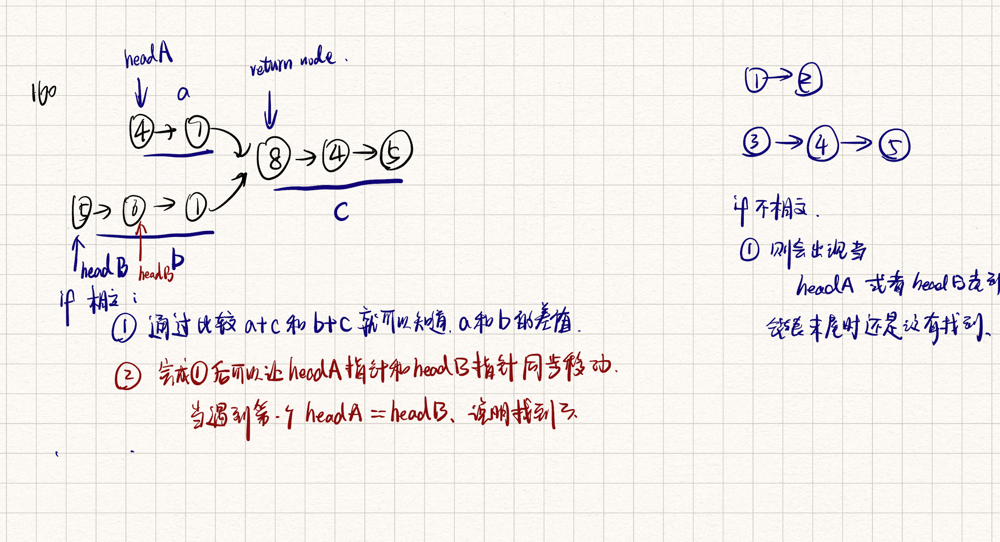

# Problem

Given the heads of two singly linked-lists `headA` and `headB`, return *the node at which the two lists intersect*. If the two linked lists have no intersection at all, return `null`.

For example, the following two linked lists begin to intersect at node `c1`:


The test cases are generated such that there are no cycles anywhere in the entire linked structure.

**Note** that the linked lists must **retain their original structure** after the function returns.

**Custom Judge:**

The inputs to the **judge** are given as follows (your program is **not** given these inputs):

- `intersectVal` - The value of the node where the intersection occurs. This is `0` if there is no intersected node.
- `listA` - The first linked list.
- `listB` - The second linked list.
- `skipA` - The number of nodes to skip ahead in `listA` (starting from the head) to get to the intersected node.
- `skipB` - The number of nodes to skip ahead in `listB` (starting from the head) to get to the intersected node.

The judge will then create the linked structure based on these inputs and pass the two heads, `headA`and `headB` to your program. If you correctly return the intersected node, then your solution will be **accepted**.

 

**Example 1:**


```
Input: intersectVal = 8, listA = [4,1,8,4,5], listB = [5,6,1,8,4,5], skipA = 2, skipB = 3
Output: Intersected at '8'
Explanation: The intersected node's value is 8 (note that this must not be 0 if the two lists intersect).
From the head of A, it reads as [4,1,8,4,5]. From the head of B, it reads as [5,6,1,8,4,5]. There are 2 nodes before the intersected node in A; There are 3 nodes before the intersected node in B.
- Note that the intersected node's value is not 1 because the nodes with value 1 in A and B (2nd node in A and 3rd node in B) are different node references. In other words, they point to two different locations in memory, while the nodes with value 8 in A and B (3rd node in A and 4th node in B) point to the same location in memory.
```

**Example 2:**


```
Input: intersectVal = 2, listA = [1,9,1,2,4], listB = [3,2,4], skipA = 3, skipB = 1
Output: Intersected at '2'
Explanation: The intersected node's value is 2 (note that this must not be 0 if the two lists intersect).
From the head of A, it reads as [1,9,1,2,4]. From the head of B, it reads as [3,2,4]. There are 3 nodes before the intersected node in A; There are 1 node before the intersected node in B.
```

**Example 3:**


```
Input: intersectVal = 0, listA = [2,6,4], listB = [1,5], skipA = 3, skipB = 2
Output: No intersection
Explanation: From the head of A, it reads as [2,6,4]. From the head of B, it reads as [1,5]. Since the two lists do not intersect, intersectVal must be 0, while skipA and skipB can be arbitrary values.
Explanation: The two lists do not intersect, so return null.
```

 

**Constraints:**

- The number of nodes of `listA` is in the `m`.
- The number of nodes of `listB` is in the `n`.
- `1 <= m, n <= 3 * 104`
- `1 <= Node.val <= 105`
- `0 <= skipA < m`
- `0 <= skipB < n`
- `intersectVal` is `0` if `listA` and `listB` do not intersect.
- `intersectVal == listA[skipA] == listB[skipB]` if `listA` and `listB` intersect.

 

**Follow up:** Could you write a solution that runs in `O(m + n)` time and use only `O(1)` memory?


## Classification & Discussion


****

# Solution



### ==Step==

- 画图
- 思考突破点


## Important details

- 需要先比较，因为一开始就可能是相交点

```python
        while currentA != None or currentB != None:
            # compare first
            if currentA == currentB:
                return currentA
            currentA = currentA.next
            currentB = currentB.next
```


## Code

```python
# Definition for singly-linked list.
# class ListNode:
#     def __init__(self, x):
#         self.val = x
#         self.next = None

class Solution:
    def getIntersectionNode(self, headA: ListNode, headB: ListNode) -> Optional[ListNode]:
        listA_len, listB_len = 0, 0
        currentA, currentB = headA, headB
        while currentA != None:
            currentA = currentA.next
            listA_len += 1
        while currentB != None:
            currentB = currentB.next
            listB_len += 1
        # 
        diff = abs(listA_len - listB_len)
        currentA, currentB = headA, headB
        if listA_len > listB_len:
            for i in range(diff):
                currentA = currentA.next
        elif listB_len > listA_len:
            for i in range(diff):
                currentB = currentB.next
        # 
        while currentA != None or currentB != None:
            # compare first
            if currentA == currentB:
                return currentA
            currentA = currentA.next
            currentB = currentB.next
        return None

# time: O(m + n)
# space: O(1)
```


## Complexity

Time Complexity:  O(m + n)

Space Complexity: O(1)