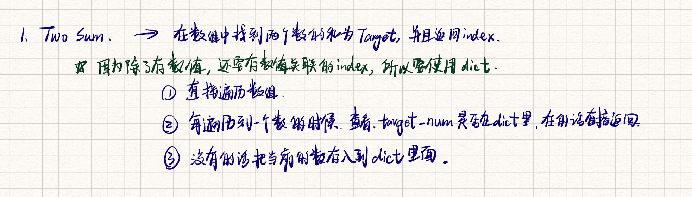

# Problem

Given an array of integers `nums` and an integer `target`, return *indices of the two numbers such that they add up to `target`*.

You may assume that each input would have ***exactly\* one solution**, and you may not use the *same* element twice.

You can return the answer in any order.

 

**Example 1:**

```
Input: nums = [2,7,11,15], target = 9
Output: [0,1]
Explanation: Because nums[0] + nums[1] == 9, we return [0, 1].
```

**Example 2:**

```
Input: nums = [3,2,4], target = 6
Output: [1,2]
```

**Example 3:**

```
Input: nums = [3,3], target = 6
Output: [0,1]
```

 

**Constraints:**

- `2 <= nums.length <= 104`
- `-109 <= nums[i] <= 109`
- `-109 <= target <= 109`
- **Only one valid answer exists.**

 

**Follow-up:** Can you come up with an algorithm that is less than `O(n2)` time complexity?


## Classification & Discussion


****

# Solution

https://programmercarl.com/0001.%E4%B8%A4%E6%95%B0%E4%B9%8B%E5%92%8C.html#%E7%AE%97%E6%B3%95%E5%85%AC%E5%BC%80%E8%AF%BE

首先我再强调一下 **什么时候使用哈希法**，当我们需要查询一个元素是否出现过，或者一个元素是否在集合里的时候，就要第一时间想到哈希法。

本题呢，我就需要一个集合来存放我们遍历过的元素，然后在遍历数组的时候去询问这个集合，某元素是否遍历过，也就是 是否出现在这个集合。

那么我们就应该想到使用哈希法了。

因为本题，我们不仅要知道元素有没有遍历过，还要知道这个元素对应的下标，**需要使用 key value结构来存放，key来存元素，value来存下标，那么使用map正合适**。

再来看一下使用数组和set来做哈希法的局限。

- 数组的大小是受限制的，而且如果元素很少，而哈希值太大会造成内存空间的浪费。
- set是一个集合，里面放的元素只能是一个key，而两数之和这道题目，不仅要判断y是否存在而且还要记录y的下标位置，因为要返回x 和 y的下标。所以set 也不能用。

此时就要选择另一种数据结构：map（python dict） ，map是一种key value的存储结构，可以用key保存数值，用value再保存数值所在的下标。





### ==Step==

1. 当我们需要查询一个元素是否出现过，或者一个元素是否在集合里的时候，就要第一时间想到哈希法。
2. 


## Important details


## Code  dict 简洁

```python
class Solution:
    def twoSum(self, nums: List[int], target: int) -> List[int]:
        records = dict()
        
        for index, value in enumerate(nums):
            if target - value in records:
                return [records[target-value], index]
            records[value] = index
        return []
```


## Code 我的代码 使用dict

```python
class Solution:
    def twoSum(self, nums: List[int], target: int) -> List[int]:
        num_dict = dict()
        for i in range(len(nums)):
            key = target - nums[i]
            if key in num_dict:
                return [num_dict[key], i]
            num_dict[nums[i]] = i
        return []

# time: O(n)
# space: O(n)
```


## Best Complexity

Time Complexity: O(n)

Space Complexity: O(n)