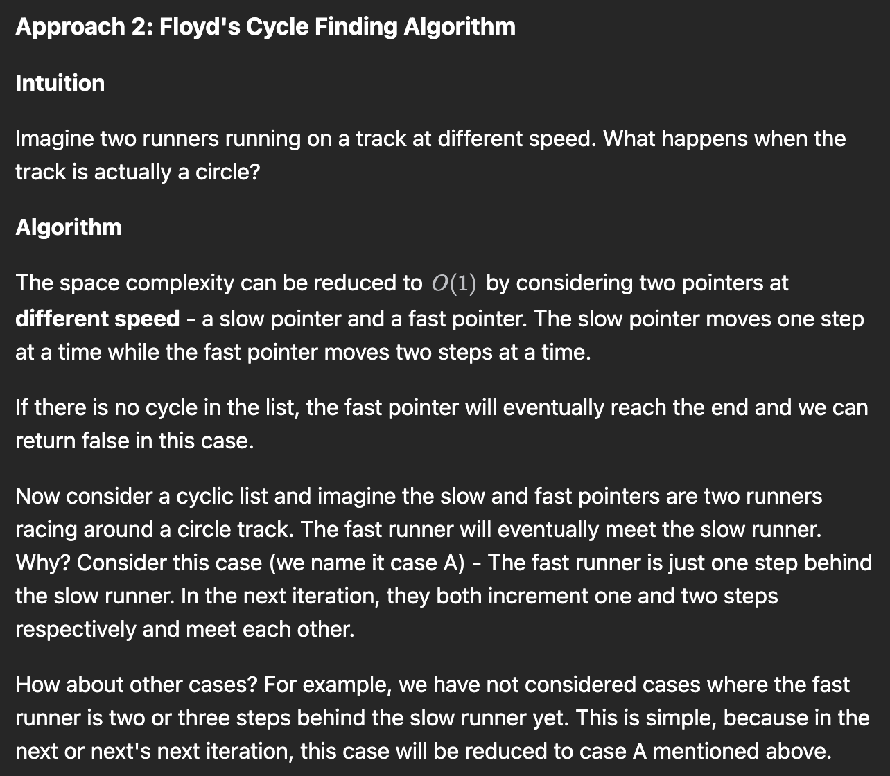

# Problem

Write an algorithm to determine if a number `n` is happy.

A **happy number** is a number defined by the following process:

- Starting with any positive integer, replace the number by the sum of the squares of its digits.
- Repeat the process until the number equals 1 (where it will stay), or it **loops endlessly in a cycle** which does not include 1.
- Those numbers for which this process **ends in 1** are happy.

Return `true` *if* `n` *is a happy number, and* `false` *if not*.

 

**Example 1:**

```
Input: n = 19
Output: true
Explanation:
12 + 92 = 82
82 + 22 = 68
62 + 82 = 100
12 + 02 + 02 = 1
```

**Example 2:**

```
Input: n = 2
Output: false
```

 

**Constraints:**

- `1 <= n <= 2^31 - 1`


## Classification & Discussion

- ==没有完全理解的点==
  - 如何证明这个序列不会无限不循环发展下去？
  - 时间复杂度

  
  
- 这题还可以用双指针法做  Floyd's Cycle-Finding Algorithm
  


****

# Solution

Complexity:

https://leetcode.com/problems/happy-number/editorial/

https://leetcode.com/problems/happy-number/editorial/

https://leetcode.cn/problems/happy-number/solutions/224894/kuai-le-shu-by-leetcode-solution/

https://leetcode.cn/problems/happy-number/solutions/225976/kuai-le-de-zhi-shi-dian-zeng-jia-liao-by-sweetiee/


### ==Step==

1. 
2. 


## Important details


## Code Floyd's Cycle-Finding Algorithm

https://leetcode.com/problems/linked-list-cycle/editorial/



- 使用快慢指针检测有没有环

- 注意这一行

  ```python
  # 只有这样是正确的
  fast, slow = self.getSumOfSquare(n), n
  # 错误，一开始fast 就等于 slow
  fast, slow = n, n
  # 错误，还没进入循环fast就会追上slow
  fast, slow = n, self.getSumOfSquare(n)
  ```
  
  

```python
class Solution:
    def getSumOfSquare(self, n: int) -> int:
        sum = 0
        while n != 0:
            n, digit = divmod(n, 10)
            sum += digit ** 2
        return sum
        

    def isHappy(self, n: int) -> bool:
        fast, slow = self.getSumOfSquare(n), n
        while fast != slow:
            slow = self.getSumOfSquare(slow)
            fast = self.getSumOfSquare(fast)
            fast = self.getSumOfSquare(fast)
        return fast == 1
    
# time: 
# space: 
```


## Code set 简化版

```python
class Solution:
    def getSumOfSquare(self, n: int) -> int:
        sum = 0
        while n != 0:
            # digit = n % 10
            # n = n // 10
            n, digit = divmod(n, 10)
            sum += digit ** 2
        return sum
        

    def isHappy(self, n: int) -> bool:
        num_set = set()
        
        while n != 1 and n not in num_set:
            num_set.add(n)
            n = self.getSumOfSquare(n)
        
        return n == 1
    
# time: 
# space: 
```


## Code 我的解法

- 这个解法顺序记得把第一个n加到集合里面

```python
class Solution:
    def getSumOfSquare(self, n: int) -> int:
        sum = 0
        while n != 0:
            digit = n % 10
            n = n // 10
            sum += digit ** 2
        return sum
        

    def isHappy(self, n: int) -> bool:
        num_set = set(n)
        
        while 1:
            sum_of_square = self.getSumOfSquare(n)
            if sum_of_square == 1:
                return True
            elif sum_of_square in num_set:
                return False
            num_set.add(sum_of_square)
            n = sum_of_square
    
    
# time: 
# space: 
```


## Complexity


Time Complexity:

Space Complexity: