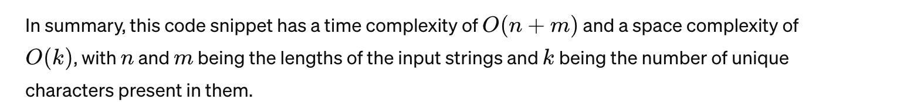

# Problem

Given two strings `s` and `t`, return `true` *if* `t` *is an anagram of* `s`*, and* `false` *otherwise*.

An **Anagram** is a word or phrase formed by rearranging the letters of a different word or phrase, typically using all the original letters exactly once.

 

**Example 1:**

```
Input: s = "anagram", t = "nagaram"
Output: true
```

**Example 2:**

```
Input: s = "rat", t = "car"
Output: false
```

 

**Constraints:**

- `1 <= s.length, t.length <= 5 * 10^4`
- `s` and `t` consist of lowercase English letters.

 

**Follow up:** What if the inputs contain Unicode characters? How would you adapt your solution to such a case?


## Classification & Discussion


****

# Solution


### ==Step==

1. 
2. 


## Important details

- 同时需要检查原始字符串的字典是不是所有值都是0


## Code  数组hash table 

- 因为只有26个小写字母的范围，所以可以直接用数组

```python
class Solution:
    def isAnagram(self, s: str, t: str) -> bool:
        record = [0] * 26
        for c in s:
            record[ord(c) - ord('a')] += 1
        for c in t:
            record[ord(c) - ord('a')] -= 1
        for i in range(26):
            if record[i] != 0:
                return False
        return True

# time: O(m + n)
# space: O(n)
```


## Code 使用Counter的简洁写法

```python
from collections import Counter

class Solution:
    def isAnagram(self, s: str, t: str) -> bool:
        s_count = Counter(s)
        t_count = Counter(t)
        
        return s_count == t_count

# time: O(n)
# space: O(n)
```




## Code 使用defaultdict 的简洁写法

```python
from collections import defaultdict

class Solution:
    def isAnagram(self, s: str, t: str) -> bool:
        s_dict = defaultdict(int)
        t_dict = defaultdict(int)

        for c in s:
            s_dict[c] += 1
        for c in t:
            t_dict[c] += 1
        
        return s_dict == t_dict

# time: O(n)
# space: O(n)
```


## Code 我的解法 defaultdict()

```python
class Solution:
    def isAnagram(self, s: str, t: str) -> bool:
        anagram_dict = collections.defaultdict(int)
        for c in s:
            anagram_dict[c] += 1
        for c in t:
            if c in anagram_dict and anagram_dict[c] != 0:
                anagram_dict[c] -= 1
            else:
                return False
        return False if sum(anagram_dict.values()) else True

# time: O(n)
# space: O(n)


```


## Best Complexity

Time Complexity:

Space Complexity: