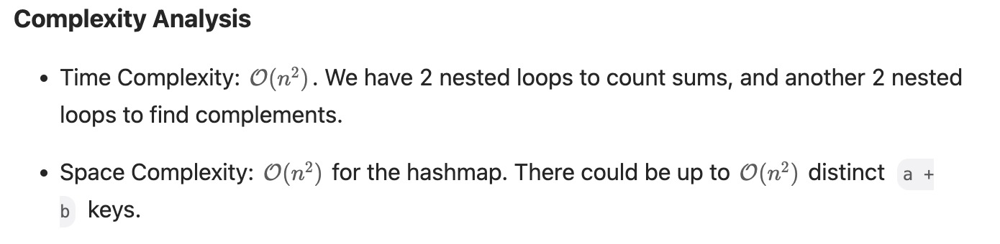

# Problem

Given four integer arrays `nums1`, `nums2`, `nums3`, and `nums4` all of length `n`, return the number of tuples `(i, j, k, l)` such that:

- `0 <= i, j, k, l < n`
- `nums1[i] + nums2[j] + nums3[k] + nums4[l] == 0`

 

**Example 1:**

```
Input: nums1 = [1,2], nums2 = [-2,-1], nums3 = [-1,2], nums4 = [0,2]
Output: 2
Explanation:
The two tuples are:
1. (0, 0, 0, 1) -> nums1[0] + nums2[0] + nums3[0] + nums4[1] = 1 + (-2) + (-1) + 2 = 0
2. (1, 1, 0, 0) -> nums1[1] + nums2[1] + nums3[0] + nums4[0] = 2 + (-1) + (-1) + 0 = 0
```

**Example 2:**

```
Input: nums1 = [0], nums2 = [0], nums3 = [0], nums4 = [0]
Output: 1
```

 

**Constraints:**

- `n == nums1.length`
- `n == nums2.length`
- `n == nums3.length`
- `n == nums4.length`
- `1 <= n <= 200`
- `-228 <= nums1[i], nums2[i], nums3[i], nums4[i] <= 228`


## Classification & Discussion


****

# Solution

https://leetcode.com/problems/4sum-ii/editorial/

https://programmercarl.com/0454.%E5%9B%9B%E6%95%B0%E7%9B%B8%E5%8A%A0II.html#%E6%80%9D%E8%B7%AF

- 记录 a + b 出现的次数即可，不需要记录出现的具体情况

A brute force solution will be to enumerate all combinations of elements using four nested loops, which results in l{O}(n^4) time complexity. A faster approach is to use three nested loops, and, for each sum `a + b + c`, search for a complementary value `d == -(a + b + c)` in the fourth array. We can do the search in {O}(1) if we populate the fourth array into a hashmap.

> Note that we need to track the frequency of each element in the fourth array. If an element is repeated multiple times, it will form multiple quadruples. Therefore, we will use hashmap values to store counts.

Building further on this idea, we can observe that `a + b == -(c + d)`. First, we will count sums of elements `a + b` from the first two arrays using a hashmap. Then, we will enumerate elements from the third and fourth arrays, and search for a complementary sum `a + b == -(c + d)` in the hashmap.


### ==Step==

1. 
2. 


## Important details


## Code

```python
from collections import defaultdict

class Solution:
    def fourSumCount(self, nums1: List[int], nums2: List[int], nums3: List[int], nums4: List[int]) -> int:
        cnt = 0
        record = defaultdict(int)
        # 
        for a in nums1:
            for b in nums2:
                record[a + b] += 1
        # 
        for c in nums3:
            for d in nums4:
                cnt += record[- (c + d)]
        # 
        return cnt

# time: O(n^2)
# space: O(n^2)
```




## Code dict O(n^3)

```python
from collections import defaultdict

class Solution:
    def fourSumCount(self, nums1: List[int], nums2: List[int], nums3: List[int], nums4: List[int]) -> int:
        # result = []
        count = 0

        nums4_dict = defaultdict(list)
        for l in range(len(nums4)):
            nums4_dict[nums4[l]].append(l)

        for i in range(len(nums1)):
            for j in range(len(nums2)):
                for k in range(len(nums3)):
                    target_key = 0 - nums1[i] - nums2[j] - nums3[k]
                    if target_key in nums4_dict:
                        count += len(nums4_dict[target_key])
        
        return count

# Time: O(n^3)
# Space: O(n)
```


## Code brute force

```python
class Solution:
    def fourSumCount(self, nums1: List[int], nums2: List[int], nums3: List[int], nums4: List[int]) -> int:
        # result = []
        count = 0
        for i in range(len(nums1)):
            for j in range(len(nums2)):
                for k in range(len(nums3)):
                    for l in range(len(nums4)):
                        if nums1[i] + nums2[j] + nums3[k] + nums4[l] == 0:
                            # result.append((i, j, k, l))
                            count += 1
        # print(result)
        return count
                    
```


## Best Complexity

Time Complexity: O(n^2)

Space Complexity: O(n^2)

 