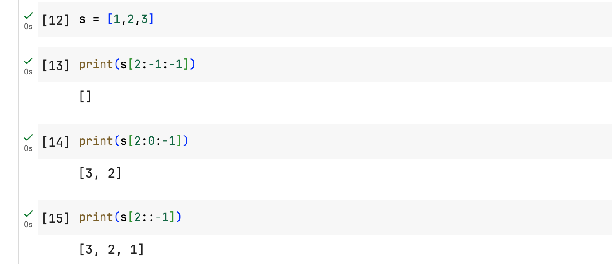

# Problem

Given a string `s` and an integer `k`, reverse the first `k` characters for every `2k` characters counting from the start of the string.

If there are fewer than `k` characters left, reverse all of them. If there are less than `2k` but greater than or equal to `k` characters, then reverse the first `k` characters and leave the other as original.

 

**Example 1:**

```
Input: s = "abcdefg", k = 2
Output: "bacdfeg"
```

**Example 2:**

```
Input: s = "abcd", k = 2
Output: "bacd"
```

 

**Constraints:**

- `1 <= s.length <= 104`
- `s` consists of only lowercase English letters.
- `1 <= k <= 104`


## Classification & Discussion


## Notes


****

# Solution


### ==Step==

1. 
2. 


## Important details

在Python中，切片操作的通用形式是 `start:stop:step`，其中：

- `start` 是切片开始的索引。
- `stop` 是切片结束的索引，实际切片不包含此索引处的元素。
- `step` 是切片的步长，决定了切片的方向（正或负）以及在开始和结束索引之间选取元素的间隔。

当 `step` 为 `-1` 时，它指定切片操作应该逆向进行，即从 `start` 索引开始，向列表的开始方向移动，直到（但不包含）`stop` 索引。如果 `start` 和 `stop` 索引被省略（保留为默认值），整个序列被逆序选择。

对于你提到的代码中的这一行：

```python
s[i:i+k] = s[i:i+k:-1]
```

意图是将字符串 `s` 中从索引 `i` 到 `i+k` 的子串逆序。然而，这个切片操作实际上是不正确的，因为当 `step` 为 `-1` 时，通常需要调整 `start` 和 `stop` 的顺序，或者省略它们以逆转整个列表。正确的逆序切片应该是：

```python
s[i:i+k] = s[i+k-1:i-1:-1]  # 当i为0时，i-1解释为到列表末尾
```

或者，更简单且不易出错的方式是直接逆序不包含结束索引的切片：

```python
s[i:i+k] = s[i:i+k][::-1]
```

这样，`s[i:i+k][::-1]` 先从 `s` 中取出从 `i` 到 `i+k` 的子列表（不包含 `i+k`），然后 `[::-1]` 对这个子列表进行逆序。这是一个更直观且正确执行逆序操作的方式。




## Code

```python
class Solution:
    def reverseStr(self, s: str, k: int) -> str:
        n = len(s)
        s = list(s)

        for i in range(0, n, 2*k):
            # 2k
            if i + k < n:
                s[i:i+k] = s[i:i+k][::-1]
            else:
                s[i:n] = s[i:n][::-1]
        
        return "".join(s)  

# time: O(n)
# space: O(n)
```


## Best Complexity

Time Complexity: O(n)

Space Complexity: O(n)